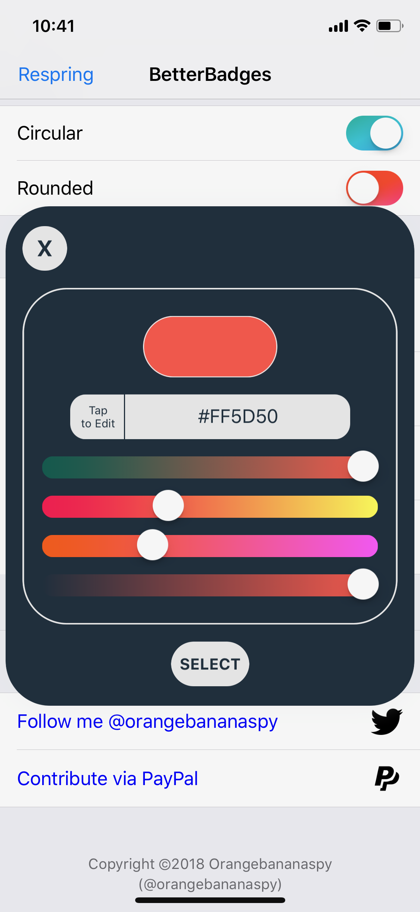
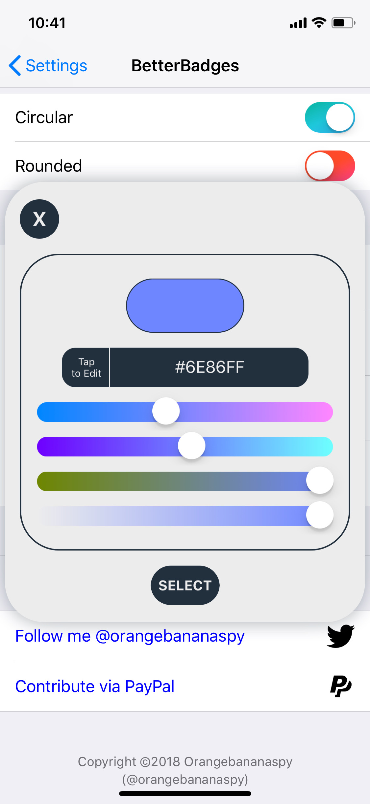
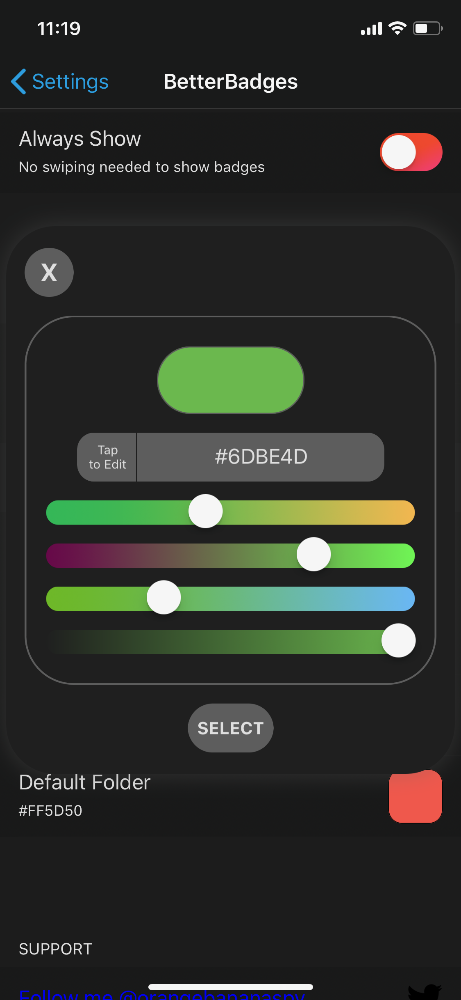
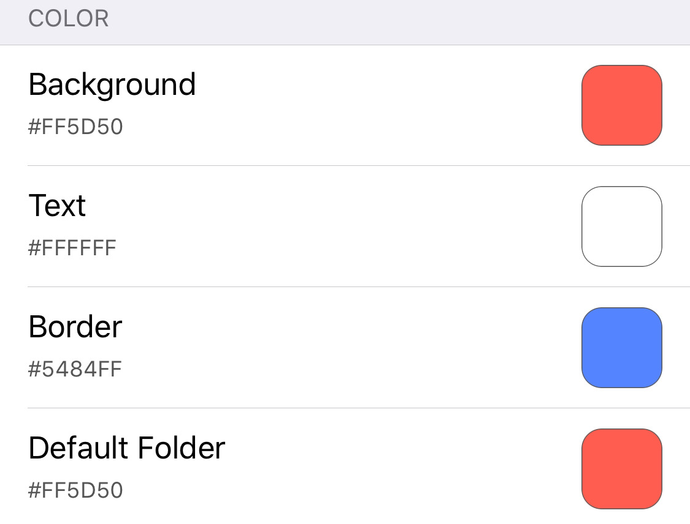
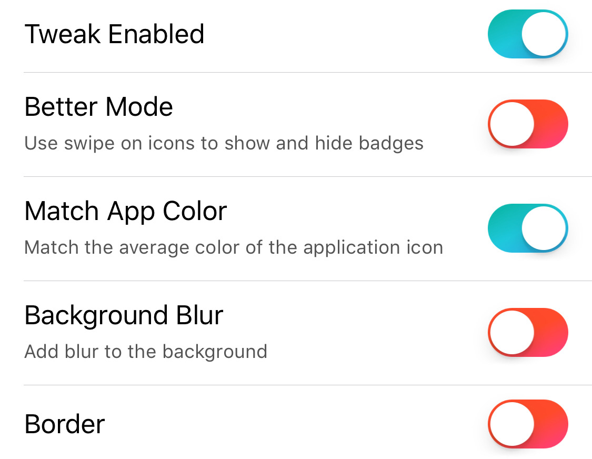

OBSUtilities
=========
This library contains the basic utilities needed to build many tweaks. Such as:
1. Light weight color picker
2. Basic color manipulation tools (Hex conversions, check if color is bright)
  * Hex conversions
  * If color is bright
3. Basic image tools
  * Average color of image
  * Creating image from color
  * Change scale of an image
  * Change color of entire image
4. Useful Preference Loader Cells
  * PSColorCell
  * PSCustomSwitchCell
  
How to Implement:
----------------------
1. Install __libobsutilities__ from Cydia.
2. Find __/usr/lib/libOBSUtilities.dylib__ from the iOS device or install it from this repo.
3. Copy the dylib into your __$THEOS/lib__ folder.
4. Add `XXX_LIBRARIES = OBSUtilities` to your Tweaks Makefile.
5. Add  `XXXPREFS_LIBRARIES = OBSUtilities` to your Prefs Makefile.
  * Basically add it as a library where ever you plan to use this library.
6. Download __OBSUtilites__ folder from this repo and place it in __$THEOS/include__ folder

Preferences Plist Specfier Examples
------------------------------------------
### PSCustomSwitchCell
```xml
<dict>
<key>cellClass</key>
<string>PSCustomSwitchCell</string>
<key>key</key>
<string>KEY_FOR_CELL</string>
<key>keyLabel</key>
<string>CELL_TITLE</string>
<key>description</key> <!-- Optional -->
<string>CELL_DESCRIPTION</string>
<key>default</key>
<true/> <!-- Default value of the switch cell -->
<key>PostNotification</key> <!-- Optional -->
<string>POSTNOTIFICATION_NAME</string>
<key>preferenceName</key> <!-- Name of the preference list to save the setting -->
<string>com.orangebananaspy.example.plist</string>
</dict>

<dict>
<key>cellClass</key>
<string>PSCustomSwitchCell</string>
<key>key</key>
<string>KEY_FOR_CELL_2</string>
<key>keyLabel</key>
<string>CELL_TITLE_2</string>
<key>default</key>
<false/>
<key>connections</key> <!-- Turns off connecting switchs if they are on -->
<array>
<string>KEY_FOR_CELL</string> <!-- Key for the connecting switch -->
</array>
<key>PostNotification</key>
<array> <!-- Can also send multiple notifications -->
<string>Notify1</string>
<string>Notify2</string>
</array>
<key>preferenceName</key>
<string>com.orangebananaspy.example.plist</string>
</dict>
```
### PSColorCell
```xml
<dict>
<key>cellClass</key>
<string>PSColorCell</string>
<key>key</key>
<string>KEY_FOR_CELL</string>
<key>keyLabel</key>
<string>CELL_TITLE</string>
<key>default</key> <!-- Default color of cell -->
<string>#000000</string>
<key>PostNotification</key> <!-- Same as PSCustomSwitchCell(can also be an array) -->
<string>Notify1</string>
<key>preferenceName</key>
<string>com.orangebananaspy.example.plist</string>
<key>isLighUI</key> <!-- Optional (if not specified it will be light) -->
<true/>
</dict>
```
The UI color of the picker is out of developers hands if Eclipse is installed and enabled for Preferences.

Preview
-------


License
----------
Please see __[LICENSE]__ file attached with this repo.

[LICENSE]: LICENSE
